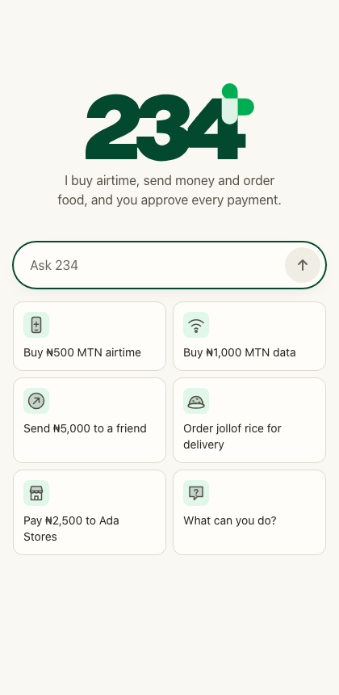
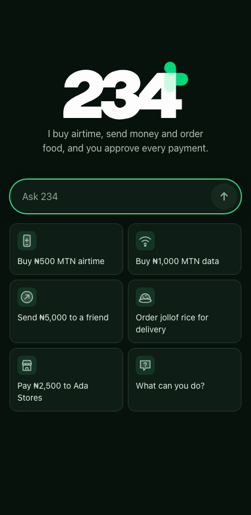
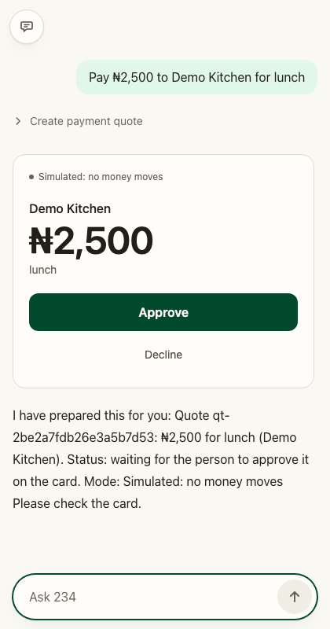

# 234

A chat assistant that buys airtime and mobile data, sends money and orders food for people in Nigeria. You talk to
it; it prepares a payment as an approval card; nothing is paid until you press Approve on the card. The model never
holds the approval.

Live demo (simulated providers, no real money): https://ask234.wintern.workers.dev

| | | |
|---|---|---|
|  |  |  |

## How it works

A Django chat host runs on a Cloudflare Python Worker. Each chat is one Python Durable Object, the turn runner, that
writes an append-only event log in D1 and pushes it to open WebSockets; the page, the model's context and crash
recovery are all folds of that log. The model calls MCP connectors (Paystack-style payments, transfers, airtime and
data through VTpass, a food merchant) that return MCP Apps cards, and each card runs in a sandbox origin of its own,
framed by a separate Worker. The connectors keep a ledger in D1 with per-visitor limits and once-only approvals.
Design notes are in [docs](docs/): [durable-chat](docs/durable-chat.md), [compaction](docs/compaction.md),
[auth](docs/auth.md), [mcp-apps-compliance](docs/mcp-apps-compliance.md), [model-behaviour](docs/model-behaviour.md),
[chat-ui](docs/chat-ui.md) and [brand](docs/brand.md).

## Status

A preview. Every provider is a simulator (`simulated` mode): no real money moves and no provider is called, and the
deployment refuses a live key at startup. Real-money use needs work that is not done here (account-tied limits,
reconciliation, a live provider account, abuse controls). Sign-in with Google was tested against the Firebase Auth
emulator only.

The assistant is measured on Nigerian-style requests with deterministic scoring and no model judge
([evaluation/RESULTS.md](evaluation/RESULTS.md)): before any tuning, 202 of 231 draws passed with two dangerous
failures (a transfer quoted at 1 kobo); after server-side guards and a shorter prompt, 207 of 231 passed with none,
on cases that were no longer held out. Read the caveats there.

## Run it locally

You need Node 24 with npm, [uv](https://docs.astral.sh/uv/) (it installs Python 3.14), GNU `timeout`
(`brew install coreutils` on macOS) and the Playwright browsers for the browser suites.

```
npm ci
npx playwright install chromium webkit
(cd host && uv sync)
(cd checkout && uv sync)
(cd conformance/a2a-python && uv sync)
tools/up.sh            # the stack on workerd with a scripted model and simulators: http://localhost:8901
tools/down.sh          # stops it
```

`tools/up.sh` uses ports 8900 to 8999 (`PORT_BASE` moves them). With no model key it answers with a scripted model.
To try a real model, export `LLM_BASE_URL` (an OpenAI-compatible endpoint), `LLM_MODEL` and `LLM_API_KEY`, then run
`tools/real-model.sh`.

`tools/check.sh` runs everything: lint, unit tests, Worker tests against local workerd and D1, browser suites in
Chromium and WebKit, the A2A oracle, crash tests and the mutation checks. It takes 15 to 35 minutes depending on the
machine, uses ports 8900 to 8999 and runs one at a time. The fast parts that the CI runs are listed in
[CONTRIBUTING.md](CONTRIBUTING.md).

## Deploy

[docs/deploy.md](docs/deploy.md) is the runbook for a Cloudflare account: three Workers and two D1 databases,
deployed by `tools/deploy.sh`.

## Configuration and secrets

Nothing secret is in git. Names only:

- Worker secrets: `DJANGO_SECRET_KEY`, `OPS_TOKEN`, `WEBHOOK_SECRET`, `CHECKOUT_MCP_TOKEN` and `MCP_ACCESS_TOKEN`,
  `SANDBOX_SIGNING_KEY` and `SIGNING_KEY`, `APPROVAL_SECRET`, `ACCOUNT_KEY` (only with sign-in), `A2A_TOKENS`
  (optional), and the model's `LLM_BASE_URL`, `LLM_MODEL`, `LLM_API_KEY`. `tools/deploy.sh` generates the ones it can.
- Untracked files at the repository root, ignored by git: `.env.local` (keys for real-model and provider test
  runs), `.env.auth.local` (`FIREBASE_PROJECT_ID`, `FIREBASE_API_KEY`, `FIREBASE_AUTH_DOMAIN`, see
  [docs/auth.md](docs/auth.md)) and `.env.deploy.local` (`SUBDOMAIN` and any Worker name you change).
- Settings such as `PRODUCT_NAME`, the daily caps and the context window are variables; see the wrangler templates
  and [docs/deploy.md](docs/deploy.md).

## Repository layout

| Path | What is in it |
|---|---|
| `host/` | The Django chat host, the turn runner and the Durable Object (`src/turns/`), accounts, A2A, the page |
| `checkout/` | The four MCP connectors, the D1 ledger, the simulators, the mutation-check table (`tools/mutations/`) |
| `card/` | The source of the approval and menu cards, built into single HTML files |
| `sandbox/` | The card sandbox Worker (JavaScript, no dependencies) |
| `design/` | The tokens that every colour comes from, the brand SVGs and their build |
| `conformance/` | Browser, protocol and Worker suites run against a local stack |
| `evaluation/` | The held-out cases, the scorer and the results |
| `tools/` | `up.sh`, `down.sh`, `check.sh`, `deploy.sh` and the other scripts |
| `docs/` | Design and operations documents and the screenshots the suites regenerate |
| `reference/` | An optional local checkout of the TypeScript original, for comparison scripts |

## Contributing

See [CONTRIBUTING.md](CONTRIBUTING.md).

## Security

Report a vulnerability privately, as [SECURITY.md](SECURITY.md) describes. Approval bypass, isolation between
owners and injection are the parts that matter most.

## Licence

Copyright (C) 2026 Tosin Amuda. Licensed under the GNU Affero General Public License, version 3 or (at your option)
any later version ([LICENSE](LICENSE), [NOTICE](NOTICE)). If you run a modified version as a service, you must offer
its source to the people who use it. Third-party components keep their own licences:
[THIRD_PARTY_NOTICES.md](THIRD_PARTY_NOTICES.md). The name, wordmark, plus symbol and icons are not licensed under the
AGPL: [TRADEMARKS.md](TRADEMARKS.md).
